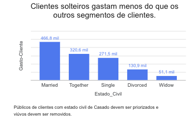
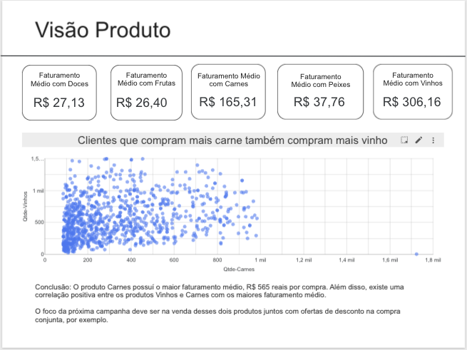
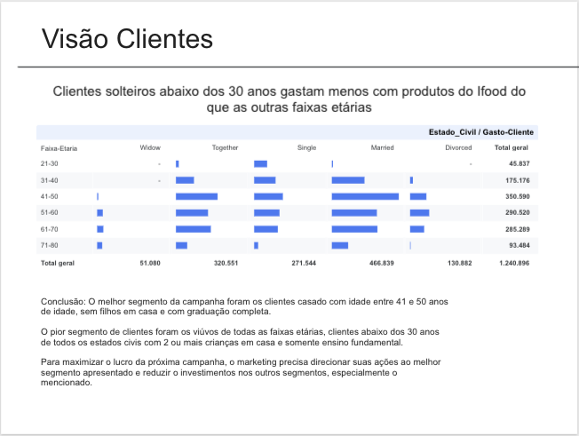
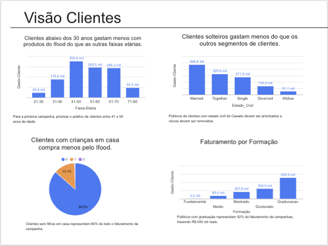

# Análise da Campanha de Marketing do Ifood

# Problema de Negócio

iFood é o principal aplicativo de entrega de comida no Brasil, presente em mais de mil cidades. 

Manter um alto engajamento do cliente é fundamental para o crescimento e a consolidação da posição da empresa como líder de mercado. Analistas de dados que trabalham na equipe de dados são constantemente desafiados a fornecer insights e valor para a empresa por meio de projetos.

Este caso pretende simular isso. Neste caso, você é apresentado a um conjunto de dados de amostra sobre o cliente e as interações da campanha iFood com esse cliente. É seu desafio entender os dados, encontrar oportunidades e insights de negócios e propor qualquer ação orientada a dados para otimizar os resultados das campanhas e gerar valor para a empresa. 

Como analista de dados, o seu objetivo é:
Fazer uma análise descritiva dos clientes com base nos comportamentos, a fim de encontrar características que permitam à empresa maximizar o lucro da próxima campanha de marketing. 

# Contexto

O time de Marketing do iFood faz campanhas recorrente para aumentar o faturamento da empresa. Porém existe uma necessidade de entender as ações que trouxeram resultados positivos e negativos para aprender e replicar nas futuras campanhas com o objetivo de aumentar o faturamento.

Nesse contexto, o Analista de Dados tem um papel fundamental para coletar, analisar e gerar insights para o time de negócio, a fim de ajudá-lo a aumentar o faturamento nas próximas campanhas.

# Premissas da análise

1. A campanha analisada ocorreu entre 15 de Janeiro de 2025 até 30 de Janeiro de 2025.
2.  Todos os produtos comprados com cupom foram removidos.
3.  A análise considerou somente os produtos do catálogo da campanha.

# Estratégia da solução

o método Fato-Dimensão foi usado para desenvolver a análise de dados da campanha de Marketing.

## Passa 1: Resumir o contexto em uma pergunta aberta

As perguntas abertas são um tipo de demanda muito comum em análise de dados no qual a demanda possui N possíveis soluções e cabe ao analista de dados avaliar as possibilidades e escolher a alternativa com o maior retorno e o menos esforço possível. Para essa análise foi definida a seguinte pergunta aberta:
**Como aumentar o resultado da próxima campanha de Marketing?**

##  Passo 2: Transformar pergunta aberta em fechada

As perguntas fechadas são um tipo de demanda muito comum na área de análise de dados. Essa demanda contém todos os detalhes da análise de dados e direciona o analista exatamente para o que precisa ser feito. Geralmente, a pergunta fechada é a escolha de uma solução entre todas as alternativas possíveis, feita por um profissional mais sênior da área.

Para essa análise foi definida a seguinte pergunta fechada:
**Quais são as características dos clientes que mais gastaram na campanha de Marketing?**

##  Passo 3: Definição da Coluna Fato

O Fato é coluna de interesse que representa o ponto focal da análise. Nesse caso, a coluna "Gasto-Clientes" representa o faturamento de cada cliente dentro da campanha e será o objetivo da nossa análise, dado que o problema de negócio envolve o aumento na próxima campanhas de Marketing.

## Passo 4: Identificação das Dimensões 

As colunas foram agrupadas em dimensões comuns que fornecem mais detalhes sobre o Fato que será analisado.
Foram organizadas as seguintes dimensões:

1. Cliente
   - Salário
   - Idade
   - Faixa-Etária
   - Dias-Cliente
   - Estado-Civil
   - Formação
   - Crianças-Casa
   - Adolescentes-Casa
   - Recência
  
2. Produto
   - Qtde-Vinhos
   - Qtde-Frutas
   - Qtde-Carnes
   - Qtde-Peixes
   - Qtde-Doces
   - Qtde-Premium

3. Comportamento de Compra
   - Qtde-Compras
   - Qtde-Compras-Web
   - Qtde-Compras-Loja
   - Visitas-Sites-Mes

4. Comportamento de Mkt
   - Reclamações

## Passo 5: Hipóteses Analíticas
Fato (Medida) + Dimensão (Detalhes) + Comparação

As hipóteses analíticas são construídas a partir da combinação do fato com as dimensões, usando sempre uma valor de comparação como maior, menor ou igual

Fato + Dimensão: Cliente - Atributos: Idade

1. O faturamento dos clientes abaixo de 30 anos é amior do que nas outra etárias.
2. O faturamento dos clientes entre 20 e 30 anos é maior do que nas outras faixas etárias.
3. O faturamento dos clientes acima dos 30 anos é maior do que nas outras faixas.

Fato + Dimensão: Cliente - Atributos: Estado Civil

4. Clientes solteiros gastam mais do que os outros segmentos de clientes.
5. Clientes solteiros gastam menos do que os outros segmentos de clientes.
6. Clientes casados gastam mais do que os outros segmentos de clientes.

Fato + Dimensão: Cliente - Atributos: Estado Civil + Idade
7. Clientes solteiros acima dos 30 anos gastam mais do clientes casados dos 30 anos

Fato + Dimensão: Cliente - Atributos: Formação Profissional

8. Clientes com formações avançadas (Doutora) gastam mais do que clientes com Ensino Fundamental
9. Clientes com maiores salários têm nível de escolaridade maior.

   
## Passo 6: Critérios de Priorização

Critério 1: Dados disponíveis
Critério 2: Insights acionável

## Passo 7: Priorização das Hipóteses Analíticas

Hipótise 1: Clientes abaixo dos 39 anos gastam mais com produtos do Ifood de que as outras faixas etárias.

Hipótese 2: Clientes solteiros gastam menos do que os outros segmentos de clientes.

Hipótese 3: Clientes solteiros abaixo dos 30 anos gastam mais com produtos do ifood do que as outras faixas etárias.

Hipótese 4: Clientes com crianças em casa compra mais pelo o Ifood.

Hipótese 5: Clientes que compram mais carne também compram mais vinho.

# Insights da análise

### Visão Geral da Campanha de Marketing

### Visão Clientes

### Conclusão: Visão Resultado Cliente

###Conclusão: Visão Produto

#Resultados

Conclusão: O melhor segmento da campanha foram os clientes casado com idade entre 41 e 50 anos de idade, sem filhos em casa e com graduação completa.

O pior segmento de clientes foram os viúvos de todas as faixas etárias, clientes abaixo dos 30 anos de todos os estados civis com 2 ou mais crianças em casa e somente ensino fundamental.

Para maximizar o lucro da próxima campanha, o marketing precisa direcionar suas ações ao melhor segmento apresentado e reduzir o investimentos nos outros segmentos, especialmente o mencionado.

## Visualize a Análise Completa

#Prósimos passos

1. Explorar mais características dos clientes
2. Automatizar a coleta e a análise para acompanhamento
3. Agrupar os clientes em grupos de maior e menor faturamento para entender se há similiridades ou não
4. Montar um dashboard de acompanhamento das métricas das futuras campanhas de marketing
